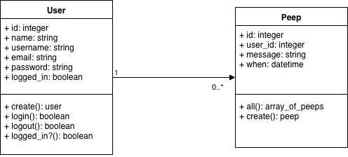
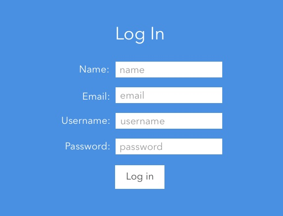
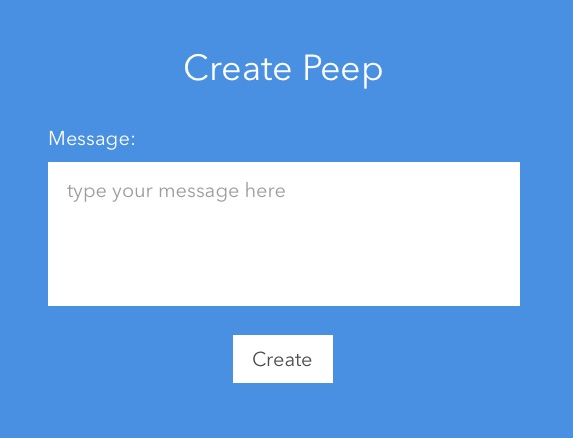

# Chitter Challenge

## Overview

To create an alternative version of Twitter called `Chitter`.

A posted message is called a `peep`.

`Peeps` are displayed in reverse chronological order.

`Peeps` are displayed with the username of the user that created it and the date and time that it was created.

A `user` can sign up, log in and create a `peep`, and log out.

To sign up, a `user` must have a unique email and username, a name and a password.

A `user` does not have to be logged in to see `peeps`.

## Set up

To run the application:

- `git clone git@github.com:jonurry/chitter-challenge.git` to clone the repository

- `bundle install` to install dependencies

- `rspec` to run all feature and unit tests tests

- `rubocop` to check for code styling issues

- `rerun 'rackup'` to launch the web server

- navigate to `http://localhost:9292/` to run the application in a web browser

## Technologies Used

- `rspec` for automated testing

- `sinatra` for the web server

- `capybara` for automating feature tests in the browser

- `rake` for automating tasks

- `rerun` for automatically re-starting the web server when code files are changed

- `rubocop` for checking code style issues

- `simplecov` for getting metrics on code coverage for the tests

## Process

## Class Design

## Routes

- `'/'` redirects to `'/peeps/all'`

- `'/peeps/all'` displays all peeps in reverse chronological order

- `'/peeps/create'` creates a peep message

- `'/user/create'` creates a Chitter user

- `'/user/login'` allows the user to login to Chitter

## User Interface Design

### Header (user not logged in)

### Header (user not logged in)

### User Log In

### Create a Peep

### Display all Peeps

